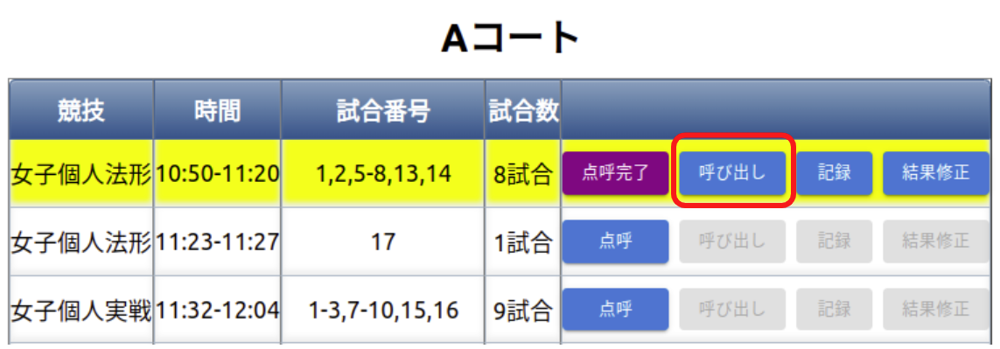
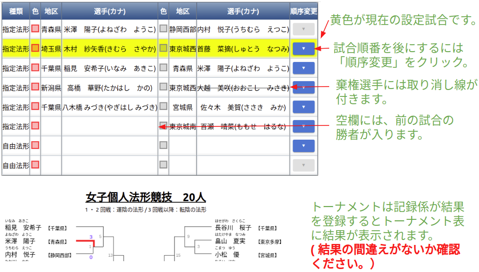
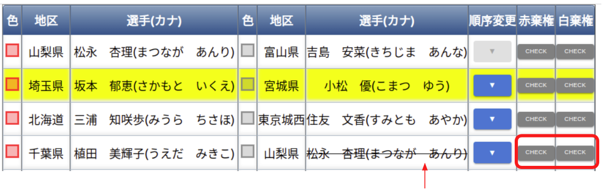

# 選手呼び出し係

- 選手棄権が出ていないか競技開始前に確認する（以下の選手呼び出し画面で確認できます）。
- 各試合時の号令・選手呼び出しを行う。

## タブレット操作方法

① 初期画面　コート選択

② 競技の「呼び出し」選択

③ 選手呼び出し画面

④ 実戦選手の途中棄権の際のメモ機能

実戦トーナメント途中で負傷し、反則勝利の際、次の試合でドクターストップが掛けられた場合、
赤・白棄権のボタンで該当選手に取り消し線を付けることができます。

※赤・白棄権ボタンをもう一度押下すると取り消し線は消えます。

※二回戦以降の棄権になるため、トーナメントに取り消し線は引かれません。

